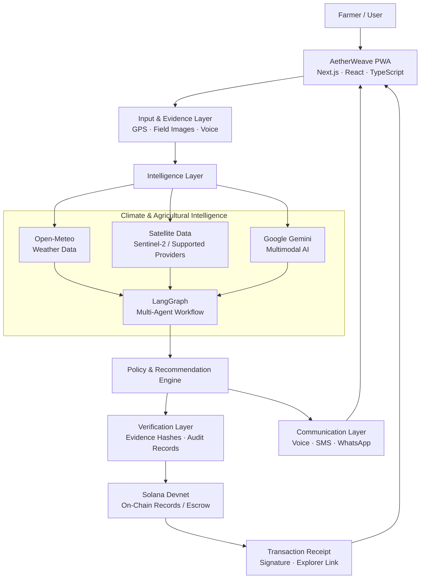
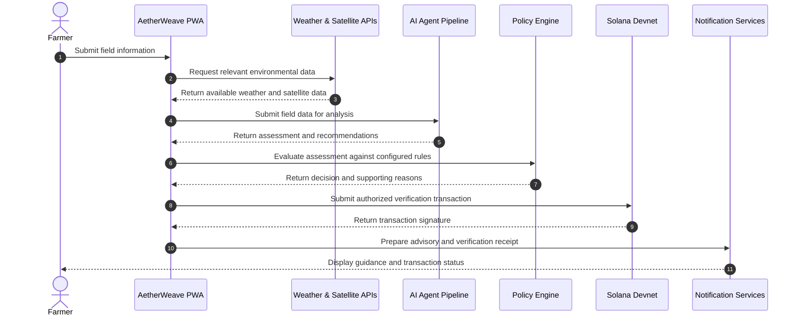
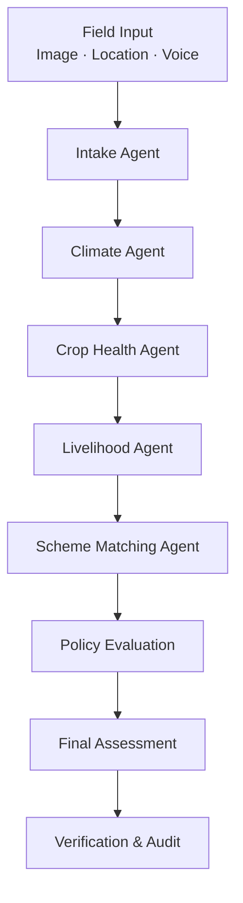

 <div align="center">
  
</div>

<h1 align="center">AetherWeave</h1>

<p align="center">
  <strong>Climate Intelligence. Agricultural Resilience. Verifiable Relief.</strong>
</p>

<p align="center">
  An AI-powered climate resilience and agricultural intelligence platform designed to help Indian farmers anticipate climate risks, make informed farming decisions, and explore transparent, blockchain-based relief workflows.
</p>

<p align="center">
  
  
  
  
  
  
  
  
</p>

---

## Table of Contents

* [Overview](#overview)
* [The Problem](#the-problem)
* [Key Features](#key-features)
* [System Architecture](#system-architecture)
* [Climate Relief Workflow](#climate-relief-workflow)
* [Application Routes](#application-routes)
* [AI Agent Architecture](#ai-agent-architecture)
* [Technology Stack](#technology-stack)
* [Integrations](#integrations)
* [Security and Privacy](#security-and-privacy)
* [Getting Started](#getting-started)
* [Environment Variables](#environment-variables)
* [Development](#development)
* [Project Status](#project-status)
* [Roadmap](#roadmap)
* [Contributing](#contributing)
* [License](#license)

---

## Overview

**AetherWeave** is an AI-powered agricultural intelligence and climate resilience platform built to help smallholder farmers in India respond to changing weather conditions and agricultural risks.

The platform brings together weather intelligence, satellite-derived vegetation indicators, multimodal AI analysis, agricultural recommendations, and blockchain-based verification into a unified digital experience.

Its goal is to help farmers make better-informed decisions about crop health, sowing, harvesting, storage, and climate-related risks while exploring a transparent mechanism for recording and verifying relief-related actions.

### What AetherWeave aims to deliver

* **Climate intelligence:** Weather-based alerts and agricultural risk assessments.
* **Agricultural guidance:** Crop recommendations, harvest timing, and storage advice.
* **AI-powered analysis:** Multimodal field assessment and conversational agricultural assistance.
* **Satellite insights:** Vegetation monitoring and geospatial analysis using available Earth observation data.
* **Verifiable records:** Cryptographic evidence and blockchain-based records on Solana Devnet.
* **Accessible communication:** Multilingual guidance, voice assistance, and SMS/WhatsApp sharing workflows.
* **Resilient access:** A responsive, installable Progressive Web App designed for mobile and desktop use.

> **Project status:** AetherWeave is a development-stage project. Features that depend on external APIs, validated agronomic models, on-chain programs, or financial integrations must be configured and tested before being considered production-ready.

---

## The Problem

Agriculture is increasingly exposed to unpredictable rainfall, extreme temperatures, drought, flooding, and post-harvest losses.

These risks can affect crop health, reduce yields, disrupt harvest schedules, and threaten farmers' livelihoods.

Traditional agricultural workflows may also involve fragmented information, delayed assessments, and limited access to timely, localized guidance.

AetherWeave aims to address these challenges through a unified workflow:

**Climate Monitoring → Risk Assessment → Agricultural Guidance → Evidence Collection → Verifiable Records**

The platform is designed to support informed decisions and improve the transparency of relief-related processes. It does not replace official disaster assessments, insurance procedures, or government compensation programs.

---

## Key Features

### 1. Climate and Weather Intelligence

* Location-based weather information using Open-Meteo.
* Rainfall, temperature, wind, and other relevant weather indicators.
* Climate-risk summaries to support agricultural planning.
* Weather-aware sowing, harvesting, and storage recommendations.

### 2. AI-Powered Agricultural Assistant

* Multimodal field analysis using Google Gemini.
* Conversational agricultural assistance.
* Crop-health observations and potential stress identification.
* Context-aware recommendations based on available weather and field information.

AI-generated results are advisory and should not be treated as certified crop-loss assessments.

### 3. Satellite-Based Vegetation Monitoring

* Vegetation monitoring using Sentinel-2-derived data where available.
* NDVI-based vegetation condition visualization.
* Geospatial analysis through supported satellite-data providers.
* Field-level monitoring and comparison workflows.

Actual satellite coverage, spatial resolution, and update frequency depend on the selected data source.

### 4. Crop Advisory and Harvest Planning

* Crop recommendations based on available agricultural inputs.
* Sowing and harvesting decision support.
* Crop growth and weather-risk considerations.
* Storage guidance based on relevant environmental conditions.
* Estimated agricultural costs and revenue where supporting data is available.

### 5. Blockchain-Based Verification

* Cryptographic hashes for evidence integrity.
* Solana Devnet transactions for recording supported verification events.
* Transaction signatures and explorer links for public verification.
* A foundation for transparent, auditable relief-related workflows.

Blockchain records can establish that a particular record or hash was submitted. They do not independently prove that a physical event occurred or that a farmer qualifies for compensation.

### 6. Climate Relief Workflow

* Climate-risk assessment and policy-based eligibility evaluation.
* Relief-related work and verification workflows.
* Solana-based escrow concepts and transaction tracking.
* A structured foundation for transparent disbursement workflows.

Actual fund transfers require a deployed and tested escrow program, authorized transactions, and a funded account. The platform does not imply access to government relief funds.

### 7. Multilingual Voice and Notifications

* English, Hindi, and Bengali interface support.
* Voice narration using ElevenLabs.
* Weather and agricultural advisories.
* SMS and WhatsApp sharing workflows.
* Communication options designed for users with limited digital literacy.

### 8. Responsive Progressive Web App

* Mobile-first and desktop-friendly interface.
* Installable PWA experience.
* Offline fallback and caching support where configured.
* Interactive dashboards, visualizations, and agricultural tools.

---

## System Architecture

The platform is organized into four logical layers: user interaction, intelligence and data processing, verification and settlement, and communication.



### Architecture Overview

| Layer         | Responsibility                                                                 |
| ------------- | ------------------------------------------------------------------------------ |
| Client        | User interface, onboarding, field data capture, and dashboards                 |
| Intelligence  | Weather retrieval, satellite data processing, AI analysis, and recommendations |
| Verification  | Evidence hashing, policy evaluation, and audit records                         |
| Blockchain    | Supported on-chain records and escrow operations                               |
| Communication | Voice guidance, notifications, and advisory sharing                            |

---

## Climate Relief Workflow

The following diagram illustrates the intended workflow for a climate-related relief assessment.



**Important:** This is a logical workflow. Real financial disbursement requires a separately implemented and authorized escrow transaction. A policy decision or blockchain record alone does not constitute a completed payment.

---

## Application Routes

The following routes describe the main application areas and API endpoints represented in the project documentation. Their implementation and live status should be verified against the current codebase.

### User-Facing Pages

| Route                   | Purpose                                 |
| ----------------------- | --------------------------------------- |
| `/`                     | Landing page and platform overview      |
| `/login`                | Mobile authentication                   |
| `/register`             | User registration and profile setup     |
| `/onboarding`           | Language selection and onboarding       |
| `/dashboard`            | Agricultural and climate overview       |
| `/climate-dbt`          | Climate relief workflow                 |
| `/weather`              | Weather information and risk indicators |
| `/crop-advisor`         | Crop recommendations and planning       |
| `/harvest-timing`       | Harvest decision support                |
| `/market-prices`        | Market price information                |
| `/companion`            | AI agricultural assistant               |
| `/verification/capture` | Field evidence capture                  |
| `/verification/status`  | Evidence verification status            |
| `/satellite`            | Satellite and vegetation monitoring     |
| `/soil-health`          | Soil-related information                |
| `/payout`               | Settlement and transaction status       |
| `/action`               | Recommended agricultural actions        |
| `/cascade`              | Climate-risk visualization              |
| `/alert-enrollment`     | Notification enrollment                 |
| `/notify`               | Community notification interface        |
| `/offline`              | Offline fallback page                   |

### API Endpoints

| Endpoint                        | Purpose                        |
| ------------------------------- | ------------------------------ |
| `/api/voice/tts`                | Text-to-speech generation      |
| `/api/auth/otp/request`         | Request an OTP                 |
| `/api/auth/otp/verify`          | Verify an OTP                  |
| `/api/weather/live`             | Retrieve weather information   |
| `/api/satellite/ndvi`           | Retrieve vegetation indicators |
| `/api/notifications/sms`        | Send SMS notifications         |
| `/api/companion/chat`           | AI assistant responses         |
| `/api/crops/recommend`          | Crop recommendations           |
| `/api/harvest/timing`           | Harvest timing analysis        |
| `/api/storage/alerts`           | Storage-related alerts         |
| `/api/market/prices`            | Market price information       |
| `/api/ai/swarm/run`             | Execute the AI agent workflow  |
| `/api/intake/submit`            | Submit field information       |
| `/api/verification/submit`      | Submit verification evidence   |
| `/api/verification/status/[id]` | Retrieve verification status   |
| `/api/payout/result/[id]`       | Retrieve transaction status    |
| `/api/swarm/result/[id]`        | Retrieve AI workflow status    |
| `/api/actions/recommended/[id]` | Retrieve recommended actions   |

---

## AI Agent Architecture

AetherWeave uses a multi-agent workflow to organize climate and agricultural analysis.

The intended pipeline separates individual responsibilities so that each stage can process relevant information and contribute to the final assessment.



### Agent Responsibilities

| Agent                 | Responsibility                                                  |
| --------------------- | --------------------------------------------------------------- |
| Intake Agent          | Validate and structure submitted field information              |
| Climate Agent         | Analyze available weather and climate indicators                |
| Crop Health Agent     | Interpret field imagery and crop-health observations            |
| Livelihood Agent      | Estimate potential agricultural impact using available data     |
| Scheme Matching Agent | Match relevant programs against configured eligibility criteria |
| Policy Engine         | Apply deterministic rules to produce a structured decision      |

The agents are software components orchestrated through a workflow framework such as LangGraph. Their outputs depend on the data sources, prompts, validation rules, and models configured for the application.

---

## Technology Stack

| Layer                   | Technology                     | Purpose                                           |
| ----------------------- | ------------------------------ | ------------------------------------------------- |
| Frontend                | Next.js 15.5, React 19         | Application framework and user interface          |
| Language                | TypeScript 5.8                 | Type-safe application development                 |
| Styling                 | Tailwind CSS v4                | Responsive UI and design system                   |
| State Management        | Zustand                        | Client-side application state                     |
| AI                      | Google Gemini                  | Multimodal analysis and conversational assistance |
| Agent Orchestration     | LangGraph                      | Structured multi-agent workflows                  |
| Weather                 | Open-Meteo                     | Weather and environmental data                    |
| Satellite Data          | Sentinel-2 / AgroMonitoring    | Vegetation monitoring and geospatial indicators   |
| Geospatial Analysis     | Google Earth Engine            | Earth observation processing where configured     |
| Blockchain              | Solana Devnet                  | On-chain records and supported transactions       |
| Smart Contracts         | Anchor / Rust                  | Solana program development where implemented      |
| Cryptographic Integrity | Web Crypto API                 | SHA-256 evidence hashing                          |
| Voice                   | ElevenLabs                     | Speech synthesis                                  |
| Authentication          | Fast2SMS OTP                   | Mobile OTP delivery                               |
| Motion                  | Framer Motion                  | UI animations                                     |
| 3D Graphics             | React Three Fiber / Three.js   | Interactive 3D visualizations                     |
| Offline Support         | PWA / Service Worker / Workbox | Caching and offline fallback                      |

---

## Integrations

| Service             | Role                                                                   |
| ------------------- | ---------------------------------------------------------------------- |
| Google Gemini       | Field analysis and AI assistant                                        |
| LangGraph           | Agent workflow orchestration                                           |
| Open-Meteo          | Weather data                                                           |
| AgroMonitoring      | Satellite-derived agricultural indicators, subject to API availability |
| Google Earth Engine | Geospatial processing, subject to project access and configuration     |
| Solana Devnet       | Blockchain transaction testing                                         |
| ElevenLabs          | Voice synthesis                                                        |
| Fast2SMS            | SMS delivery and OTP integration                                       |

External integrations may require API credentials, account access, rate limits, and service-specific configuration.

---

## Security and Privacy

AetherWeave is designed with data integrity and privacy in mind.

### Security considerations

* Keep API keys and private credentials in server-side environment variables.
* Never expose secret keys or signing credentials in client-side bundles.
* Validate incoming API requests and enforce authorization checks.
* Hash evidence files using SHA-256 when integrity verification is required.
* Store only the information necessary for the intended workflow.
* Avoid publishing personal information or precise field coordinates in public blockchain records.
* Protect OTP workflows with expiration, rate limits, and abuse prevention.
* Require explicit authorization for blockchain transactions and financial operations.

### Important limitations

* A SHA-256 hash can help detect changes to a file, but does not establish when or where the image was captured.
* Browser GPS and device sensors do not constitute hardware-backed attestation.
* A Solana transaction is publicly verifiable, but does not independently prove the truth of an off-chain claim.
* A test transaction on Devnet is not a real-world payment.
* AI-generated assessments should not be treated as certified agricultural, insurance, or government determinations.

---

## Getting Started

### Prerequisites

* Node.js 20.x or another version supported by the project.
* npm.
* Git.
* API credentials for any external integrations you intend to use.
* A Solana Devnet wallet and configured RPC access for blockchain testing.

### 1. Clone the Repository

```bash
git clone https://github.com/Ayushnot41/AetherWave.git
cd AetherWave
```

### 2. Install Dependencies

```bash
npm install
```

### 3. Configure Environment Variables

Create a local environment file:

```bash
cp .env.example .env.local
```

Add the credentials required by the integrations you plan to run.

### 4. Start the Development Server

```bash
npm run dev
```

Open:

http://localhost:3000

### 5. Build for Production

```bash
npm run build
```

Run the build and any configured tests before deploying.

---

## Environment Variables

The following are example variable names. Use the exact names required by the application code and `.env.example`.

| Variable                 | Purpose                                        |
| ------------------------ | ---------------------------------------------- |
| `GEMINI_API_KEY`         | Google Gemini API access                       |
| `ELEVENLABS_API_KEY`     | ElevenLabs speech synthesis                    |
| `FAST2SMS_API_KEY`       | Fast2SMS integration                           |
| `AGROMONITORING_API_KEY` | AgroMonitoring integration                     |
| `GOOGLE_MAPS_API_KEY`    | Google Maps integration, if used               |
| `SOLANA_RPC_URL`         | Solana RPC endpoint                            |
| `SOLANA_PROGRAM_ID`      | Deployed Solana program address, if applicable |

**Never commit `.env.local`, private keys, wallet seed phrases, or other secrets to Git.**

---

## Development

### Common Commands

```bash
# Start the development server
npm run dev

# Run the production build
npm run build

# Start the production server
npm run start

# Run linting, if configured
npm run lint
```

Check `package.json` for the exact scripts available in the repository.

---

## Project Status

AetherWeave is being developed as a climate-resilience and agricultural intelligence platform.

The application combines a web interface, external data integrations, AI-assisted analysis, and a Solana-based verification concept.

Feature availability depends on implementation, configuration, and successful integration testing.

| Component             | Status                                                   |
| --------------------- | -------------------------------------------------------- |
| Web application       | Under development                                        |
| Weather integration   | Requires configuration and validation                    |
| AI assistant          | Requires model configuration and testing                 |
| Multi-agent workflow  | Requires workflow validation                             |
| Satellite monitoring  | Depends on data availability and provider access         |
| OTP authentication    | Requires gateway configuration and security testing      |
| Evidence verification | Requires implementation and integrity testing            |
| Solana integration    | Requires program deployment and transaction testing      |
| Escrow and payouts    | Requires secure implementation and end-to-end validation |
| Production deployment | Not implied by Devnet or local testing                   |

---

## Roadmap

* [ ] Validate the complete field-data ingestion workflow.
* [ ] Improve the multi-agent climate and agricultural analysis pipeline.
* [ ] Integrate and validate satellite-derived vegetation indicators.
* [ ] Implement evidence integrity verification and audit records.
* [ ] Deploy and test Solana programs on Devnet.
* [ ] Complete contractor and work-order management workflows.
* [ ] Implement secure escrow authorization and settlement testing.
* [ ] Improve offline functionality and data synchronization.
* [ ] Expand multilingual agricultural guidance.
* [ ] Perform security, privacy, and reliability testing before production deployment.

---

## Contributing

Contributions, suggestions, and issue reports are welcome.

1. Fork the repository or obtain collaborator access.
2. Create a feature branch.
3. Make focused changes.
4. Run the available checks and tests.
5. Submit a pull request describing the changes.

Please avoid committing credentials, private keys, or sensitive user data.

---

## License

This project is licensed under the **MIT License**. See the [LICENSE](LICENSE) file for details.
