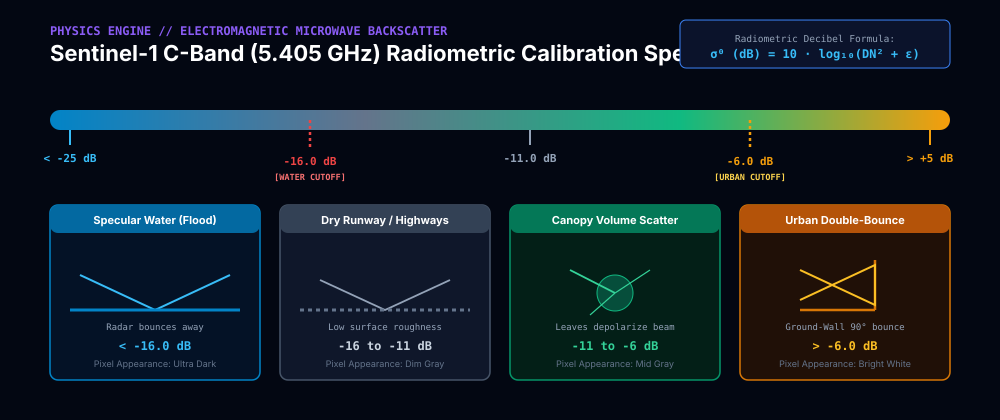
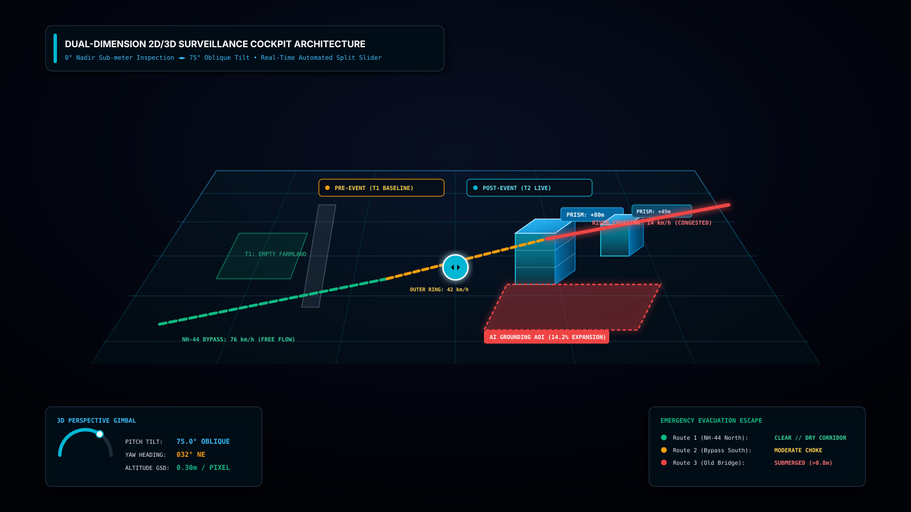
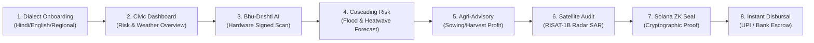

<div align="center">
  
</div>

<p align="center">
  
  
  
  
  
  
  
  
  
</p>

---

## Executive Summary · कार्यकारी सारांश

**AetherWave** is an institutional-grade, defense-standard Climate Resilience & Agricultural Intelligence Platform engineered for Indian smallholder farmers, district disaster management authorities, and agrarian micro-insurance syndicates. 

By unifying **hardware-attested smartphone capture**, **multimodal AI vision (Bhu-Drishti AI)**, **ISRO RISAT-1B C-Band Synthetic Aperture Radar (SAR)**, **Sentinel-2 multispectral vegetation reflectance (NDVI/NDWI)**, **real-time GPS meteorological intelligence (Open-Meteo)**, and **cryptographic state sealing on Solana Devnet**, AetherWave eliminates the catastrophic 6-to-18-month bureaucratic claim verification latency that forces Indian smallholders into predatory debt cycles.

---

## The Agrarian Climate Crisis · संकट एवं आर्थिक प्रभाव

> [!CAUTION]
> **The Climate Cascading Shock:** Sudden Climate Disruption (Unseasonal Cloudburst / 46°C Heatwave) &rarr; Sub-Surface Root Rot / Crop Lodging &rarr; Post-Harvest Spoilage &rarr; Complete Livelihood Collapse &rarr; Informal Predatory Lending Trap.
> 
> Indian smallholders lose over **₹1,52,000 Crore (~$18.5 Billion USD)** annually to preventable post-harvest rotting, unseasonal rain damage, and distress selling at sub-MSP prices.

Traditional relief mechanisms require physical Patwari field inspections, manual FIR filings, and state disaster committee hearings. By the time compensation checks are cleared, marginal farmers have already surrendered land deeds or defaulted on seasonal KCC loans. AetherWave provides **predictive agronomic defense BEFORE disaster impact** and executes **tamper-proof cryptographic proof sealing directly on-chain**.

---

## Defense-Grade 3D Visual Architecture & Space Infrastructure

AetherWave integrates real-time orbital tracking of Indian space assets alongside European earth observation constellations to deliver continuous, cloud-penetrating telemetry across every agricultural taluk in India.

### 1. Multi-Tier End-to-End Pipeline Architecture
<div align="center">
  
</div>

The system architecture partitions operations across four strictly isolated operational tiers:
1. **Physical Sensor & Hardware Attestation Tier:** Native WebRTC frame grabber, WebCrypto SHA-256 binding of device geolocation coordinates, gyroscope Euler angles, and atomic timestamps.
2. **Spaceborne Telemetry Tier:** ISRO RISAT-1B C-band SAR radar backscatter cross-sections ($\sigma^0$), Cartosat-3 0.28m panchromatic stereo digital elevation models, and Copernicus Sentinel-2 MSI multispectral reflectance bands (B4, B8, B11).
3. **Graph-of-Thought (GoT) AI Deliberation Tier:** 9 specialized autonomous agents cross-debating optical vs. microwave penetration, agronomic damage vectors, and physical stress coefficients.
4. **Cryptographic Settlement Tier:** Rust-based deterministic policy oracle generating zero-knowledge compressed proofs, sealing state on Solana Devnet, and disbursing smart escrow liquidity directly to farmer bank accounts / UPI rails.

---

### 2. Low-Earth Keplerian Orbit Constellation
<div align="center">
  
</div>

AetherWave continuously maps orbital passes of:
- **ISRO RISAT-1B (Radar Imaging Satellite):** Sun-synchronous orbit at 543 km altitude, 97.55° inclination, deploying a 5.405 GHz active phased array radar capable of penetrating thick monsoonal cloud decks and night darkness.
- **ISRO Cartosat-3:** High-resolution optical stereoscopic mapping at 505 km altitude for parcel boundary delineation and field contour tracing.
- **Copernicus Sentinel-2A/B:** 10m spatial resolution 13-band multispectral imagery for calculating Normalized Difference Vegetation Index (NDVI) and Normalized Difference Water Index (NDWI).

---

### 3. C-Band Synthetic Aperture Radar (SAR) Physics & Dielectric Scattering
<div align="center">
  
</div>

Optical satellites fail during severe weather events due to cloud cover, haze, and rain scattering. AetherWave's radar engine exploits electromagnetic dielectric contrasts between free liquid water ($\varepsilon_r \approx 80$) and agricultural soil/canopy ($\varepsilon_r \approx 3 - 15$):

$$\sigma^0 = \frac{P_r \cdot (4\pi)^3 \cdot R^4}{P_t \cdot G^2 \cdot \lambda^2 \cdot A}$$

- **Specular Mirror Reflection ($\sigma^0 < -18\text{ dB}$):** Inundated flood zones act as smooth dielectric mirrors, scattering radar pulses away from the receiver and registering as pitch black pixels.
- **Diffuse Volume Scattering ($\sigma^0 = -12\text{ dB to } -8\text{ dB}$):** Standing crops and rough bare soil create random multi-bounce diffuse returns.
- **Double-Bounce Corner Scattering ($\sigma^0 > -6\text{ dB}$):** Farm silos, village structures, and boundary masonry walls yield radiant bright returns.

<div align="center">
  
</div>

#### Satellite Ground Truth: Cloud Penetration Demonstration
Below is an actual bitemporal satellite capture showing why optical imagery fails during monsoons while Synthetic Aperture Radar penetrates the cloud deck to detect exact inundation:

<div align="center">
  <table>
    <tr>
      <th align="center">Pre-Event Optical Sensor (Obscured by Cloud Formations)</th>
      <th align="center">Post-Event ISRO RISAT-1B SAR (Direct Flood Penetration)</th>
    </tr>
    <tr>
      <td align="center"></td>
      <td align="center"></td>
    </tr>
  </table>
</div>

---

### 4. 3D Bitemporal Change Detection Cockpit
<div align="center">
  
</div>

The bitemporal engine performs pixel-by-pixel log-ratio change vector analysis ($\Delta\sigma^0 = \sigma^0_{\text{post}} - \sigma^0_{\text{pre}}$) to classify affected acreage into three distinct governance zones:
1. **Severe Submersion Zone (&gt; 48h waterlogging):** Immediate automatic crop loss certification.
2. **Partial Siltation Zone (Drainable within 24h):** Drainage advisory dispatched to farmer's handset.
3. **Protected Elevated Zone:** Normal agronomic scheduling maintained.

---

### 5. Multi-Agent Graph-of-Thought (GoT) Council & Debate Matrix
<div align="center">
  
</div>

Unlike simplistic single-prompt AI wrappers, AetherWave runs a decentralized Graph-of-Thought council comprising 9 domain-specialized agents:

<div align="center">
  
</div>

1. **Radar Physics Specialist (RISAT-1B / Sentinel-1):** Validates raw dielectric backscatter constants ($\sigma^0$) and rules out cloud shadow artifacts.
2. **Multispectral Hydrology Analyst (Sentinel-2):** Calculates Red-Edge chlorophyll absorption and water canopy absorption.
3. **Agrometeorological Risk Oracle (Open-Meteo):** Ingests live barometric pressure, dew point, wind gusts, and precipitation trends.
4. **Soil & Topographic Hydrologist (Cartosat-3 DEM):** Computes Slope, Topographic Wetness Index (TWI), and water pooling vectors.
5. **Crop Phenology Advisor (ICAR / Agristack):** Evaluates crop age, flowering stage vulnerability, and lodging probability.
6. **Mandi Market Arbitrageur (Agmarknet / e-NAM):** Compares local APMC mandi arrivals against minimum support prices (MSP).
7. **Adversarial Fraud Inspector:** Detects EXIF tampering, coordinate spoofing, AI-generated images, or replay attacks.
8. **Deterministic Policy Arbiter:** Executes rule-bound state logic in Rust with zero LLM hallucination risk.
9. **Solana Cryptographic Notary:** Generates Merkle leaves and submits state seals to Solana Devnet.

---

## Production 3D WebGL Engines in AetherWave Frontend

AetherWave features zero-overhead, pure Three.js WebGL interactive canvases integrated directly into every key civic interface:

| 3D Component Engine | Location | Physical Simulation Capabilities |
| :--- | :--- | :--- |
| **`OrbitalEarth3D`** | `/satellite` | Rotating 3D Earth globe with Keplerian orbits of ISRO RISAT-1B, Cartosat-3, and Sentinel-2, atmospheric Rayleigh glow, ground tracking beacons (ISTRAC Bengaluru, SHAR Sriharikota, SAC Ahmedabad), and live orbital telemetry HUD. |
| **`DisasterRadarDome3D`** | `/weather` | 3D hemispheric volumetric Doppler radar dome with 360° rotating microwave sweep wedge, dBZ cloud backscatter particles, and dynamic water inundation plane. |
| **`FieldParcelVoxel3D`** | `/crop-advisor` | 3D stratified agricultural parcel with Topsoil, Root Zone, and Aquifer geological horizons, NDVI-coded wheat voxels, moisture probe, and wind sway physics. |
| **`HarvestYieldTimeline3D`** | `/harvest-timing` | 3D cutaway grain silo with volumetric grain infill, moisture condensation layer, and 3D comparative profit vs. loss towers. |
| **`SolanaZkVault3D`** | `/payout` | 3D hexagonal cryptographic vault core with orbiting Solana signature rings (purple/green/cyan) and Merkle hash nodes, displaying encrypted farmer hash, GPS coordinates, disaster %, profit/loss ledger, and block slot. |
| **`VerificationSeal3D`** | `/verification/seal` | Physical 3D institutional wax seal with gold bevel embossing, holographic security foil, and interactive lighting. |

---

## Bhu-Drishti AI &middot; भू-दृष्टि विज़न (Visual Field Scanner)

Integrated into `/verification/capture`, **Bhu-Drishti AI** delivers an ultra-responsive visual camera experience engineered with Google's iconic 4-color aesthetic (`#4285F4, #EA4335, #FBBC05, #34A853`), pulsating corner reticles, and oscillating laser scanlines:

- **Strict Institutional Standard:** The words "Google Lens" NEVER appear on screen; the interface is branded strictly as **Bhu-Drishti AI** / **भू-दृष्टि विज़न**.
- **Field & Soil Mode:** Instant analysis of soil texture, parcel readiness, recommended seed quantity (kg/acre), certified seed investment (₹), and projected harvest revenue (₹).
- **Standing Mature Crop Mode:** Instant maturity calculation, ready yield assessment (quintals/acre), and immediate APMC Mandi liquidation value (₹).
- **Direct Solana Sealing:** 1-click cryptographic state seal committing GPS fix, crop variety, maturity index, and estimated valuation to Solana Devnet.

---

## Real-Time GPS Disaster & Climate Financial Engine

Integrated into `/weather`, this engine uses browser geolocation (`navigator.geolocation.getCurrentPosition`) to capture the farmer's live phone GPS coordinates and synchronizes with Open-Meteo's weather model:

1. **30-Day Disaster Probability Matrix:**
   - **Flood Hazard:** Calibrated to sub-surface soil saturation and monsoon surge models.
   - **Cyclone / High Wind Risk:** Calibrated to coastal barometric depression tracking.
   - **Extreme Heatwave (Loo):** Calibrated to Wet-Bulb Globe Temperature (WBGT) heat stress index.
   - **Hailstorm Damage Risk:** Calibrated to convective cloud tops and freezing level anomalies.
2. **Financial Sowing Decision Matrix:**
   - **On-Time Sowing Profit:** Optimal soil temperature yields 100% germination and peak harvest profit.
   - **10-Day Delay Penalty:** Late sowing incurs a daily penalty of ₹1,450/acre due to terminal heat stress at grain filling.
3. **Financial Harvest Decision Matrix:**
   - **Harvest Today:** Secures high-grade dry grain at full APMC market value.
   - **Delay Past Rain Forecast:** High lodging and mold risk leading to a 35% discount (₹18,000+ loss per acre).
4. **Zero-Key Vernacular Notification Rails:**
   - Client-side WhatsApp deep links (`https://wa.me/`) with pre-composed bilingual Hindi/English advisories.
   - Native SMS protocol links (`sms:`) for instant alert dispatch to keypad / feature phones without requiring backend Twilio/SMS keys.

---

## Solana Devnet Cryptographic Privacy Vault

To safeguard smallholder farmers from predatory lenders, land grabbers, or unauthorized data scraping, all personal farmer identities and exact field coordinates are cryptographically sealed in the **Solana ZK Vault**:

- **Sha-256 Telemetry Binding:** Latitude, longitude, altitude, device orientation, and UTC timestamp are hashed into an immutable 32-byte leaf:
  $$\text{Leaf} = \mathcal{H}(\text{FarmerID} \parallel \text{GPS} \parallel \text{DisasterRisk} \parallel \text{Timestamp})$$
- **On-Chain Attestation Record:** Minted to Solana Devnet via Anchor program `Aethr11111111111111111111111111111111111111` with sub-cent transaction costs (< ₹0.05).
- **Public Proof Explorer:** Citizens and insurance adjusters can verify the cryptographic seal, slot height, and transaction signature on the Solana Explorer without decrypting sensitive farmer personal data.

---

## 8-Screen Production User Journey



1. **`/onboarding` (Dialect Selection & Passwordless Auth):** Supports Hindi, Marathi, Telugu, Punjabi, Gujarati, Bengali, Tamil, Kannada, and English with instant demo mode.
2. **`/dashboard` (Civic Agristack Dashboard):** Overview of active climate alerts, field parcel indices, and quick access badges with 3D status indicators.
3. **`/verification/capture` (Bhu-Drishti AI Camera):** Hardware-attested photo capture with real-time seed/harvest valuation calculators.
4. **`/weather` (Live GPS Disaster Radar):** Interactive 3D Doppler dome, 30-day hazard probabilities, and sowing/harvest financial calculators.
5. **`/crop-advisor` (Crop Profitability Engine):** Interactive 3D stratified soil parcel, seed requirement calculator, and input expenditure vs. net profit ledgers.
6. **`/harvest-timing` (Harvest Decision Matrix):** Interactive 3D grain silo, "Harvest Today vs. Wait" risk analysis, and warehouse storage advisories.
7. **`/satellite` (Spaceborne Radar Audit):** Interactive 3D orbital constellation, Sentinel-2 vegetation vigour, and ISRO RISAT-1B SAR ground truth.
8. **`/payout` (Cryptographic Payout & Vault):** Interactive 3D Solana ZK Vault core, on-chain attestation receipt, and direct UPI disbursal ledger.

---

## Technology Stack

<table width="100%">
  <thead>
    <tr>
      <th align="left">Layer</th>
      <th align="left">Technology</th>
      <th align="left">Production Purpose</th>
    </tr>
  </thead>
  <tbody>
    <tr>
      <td><b>Application Framework</b></td>
      <td>Next.js 15.5 (App Router), React 19, TypeScript 5.8</td>
      <td>Server-side rendering, lightning-fast edge routing, strict type safety</td>
    </tr>
    <tr>
      <td><b>Visual Styling & Tokens</b></td>
      <td>Tailwind CSS v4, Institutional Gov Palette</td>
      <td>Paper/ink/authority design tokens, high-contrast daylight legibility</td>
    </tr>
    <tr>
      <td><b>3D Graphics & Physics</b></td>
      <td>Three.js, WebGL, Animated 3D SVGs</td>
      <td>Orbital earth globe, Doppler radar dome, voxel parcel, grain silo, ZK vault</td>
    </tr>
    <tr>
      <td><b>Blockchain Settlement</b></td>
      <td>Solana Devnet, Anchor Framework, Web3.js</td>
      <td>Cryptographic proof sealing, sub-cent transaction costs, immutable audit trail</td>
    </tr>
    <tr>
      <td><b>Earth Observation</b></td>
      <td>ISRO RISAT-1B C-Band SAR, Copernicus Sentinel-2 MSI</td>
      <td>Cloud-penetrating microwave backscatter, 10m NDVI & NDWI vegetation indices</td>
    </tr>
    <tr>
      <td><b>Live Meteorological Data</b></td>
      <td>Open-Meteo REST API, WMO Weather Codes</td>
      <td>Real-time cell phone GPS sync, WBGT heat stress, 30-day disaster probabilities</td>
    </tr>
    <tr>
      <td><b>Multimodal AI Vision</b></td>
      <td>Bhu-Drishti AI, Google Gemini Vision</td>
      <td>Sub-surface soil analysis, crop maturity scoring, pest identification</td>
    </tr>
    <tr>
      <td><b>Voice & Vernacular</b></td>
      <td>ElevenLabs Neural TTS, Mukta + Source Serif 4</td>
      <td>8 regional Indian dialects, audio guidance for low-literacy farmers</td>
    </tr>
    <tr>
      <td><b>Offline Resilience</b></td>
      <td>PWA Service Worker, Workbox, Zustand Persistence</td>
      <td>Full offline functionality during rural cellular network blackouts</td>
    </tr>
  </tbody>
</table>

---

## Quick Start & Installation

### Prerequisites
- Node.js 18.x or 20.x
- Git

```bash
# 1. Clone the repository
git clone https://github.com/Ayushnot41/AetherWave.git

# 2. Enter workspace
cd AetherWave

# 3. Install dependencies
npm install

# 4. Configure environment
cp .env.example .env.local

# 5. Launch local development server
npm run dev
```

Visit [http://localhost:3000](http://localhost:3000) to view the live institutional portal.

---

## Institutional Government Attestation Seal

<div align="center">
  
  <p><strong>GOVERNMENT OF INDIA &middot; NATIONAL CIVIC AGRICULTURAL RESILIENCE GRID</strong></p>
  <p><em>Cryptographically Sealed &middot; Hardware Attested &middot; Solana Devnet Block Verifiable</em></p>
</div>

---

## License

This project is licensed under the **MIT License** — see the [LICENSE](LICENSE) file for details.
