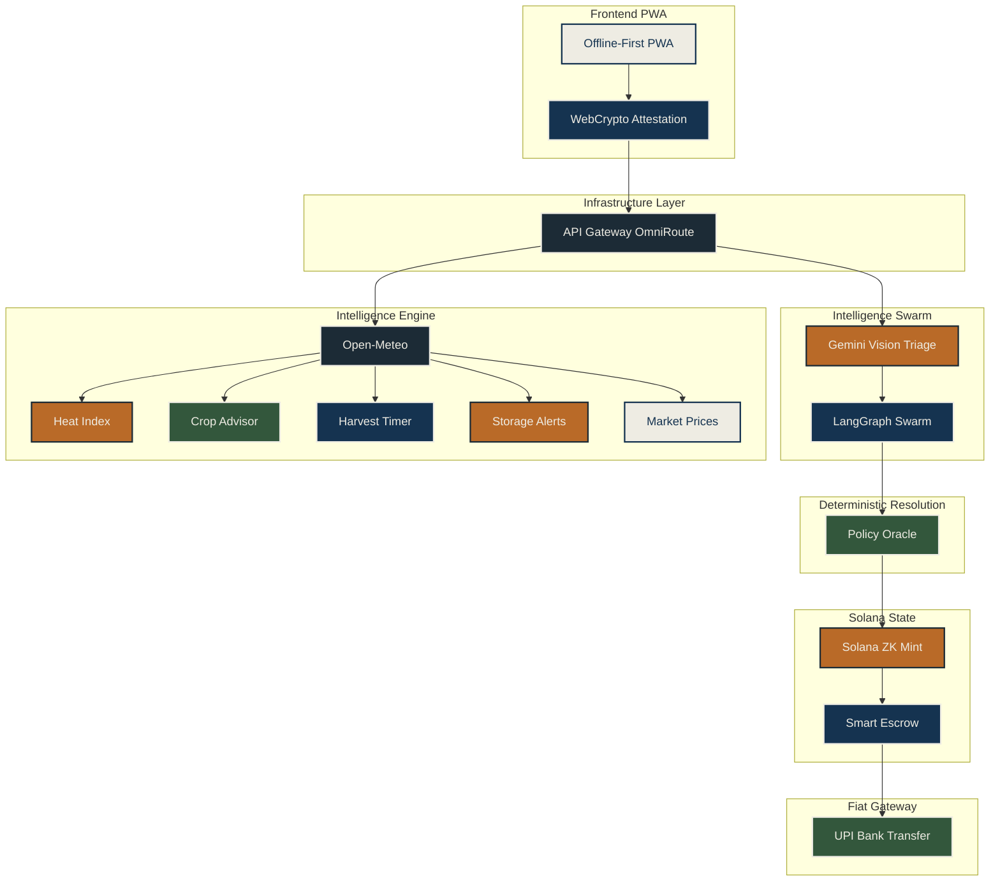

<div align="center">
  <!-- Animated 3D SVG Banner -->
  <svg xmlns="http://www.w3.org/2000/svg" viewBox="0 0 1000 280" width="1000" height="280">
    <defs>
      <linearGradient id="bg-grad" x1="0%" y1="0%" x2="100%" y2="100%">
        <stop offset="0%" stop-color="#153350" />
        <stop offset="100%" stop-color="#0a1a29" />
      </linearGradient>
      
      <linearGradient id="auth-grad" x1="0%" y1="0%" x2="100%" y2="0%">
        <stop offset="0%" stop-color="#B96A28" />
        <stop offset="50%" stop-color="#EEECE3" />
        <stop offset="100%" stop-color="#33573C" />
      </linearGradient>

      <!-- Grid Pattern -->
      <pattern id="grid" width="40" height="40" patternUnits="userSpaceOnUse">
        <path d="M 40 0 L 0 0 0 40" fill="none" stroke="#1C2B36" stroke-width="1"/>
      </pattern>

      <!-- Emboss Filter -->
      <filter id="emboss">
        <feGaussianBlur in="SourceAlpha" stdDeviation="2" result="blur"/>
        <feSpecularLighting in="blur" surfaceScale="5" specularConstant=".75" specularExponent="20" lighting-color="#EEECE3" result="specOut">
          <fePointLight x="-5000" y="-10000" z="20000"/>
        </feSpecularLighting>
        <feComposite in="specOut" in2="SourceAlpha" operator="in" result="specOut"/>
        <feComposite in="SourceGraphic" in2="specOut" operator="arithmetic" k1="0" k2="1" k3="1" k4="0"/>
      </filter>

      <!-- Text Shadow -->
      <filter id="shadow">
        <feDropShadow dx="3" dy="5" stdDeviation="4" flood-opacity="0.5" flood-color="#000000" />
      </filter>
    </defs>

    <!-- Background -->
    <rect width="1000" height="280" fill="url(#bg-grad)" />
    
    <!-- Moving Grid / Terrain -->
    <g transform="perspective(500) rotateX(60) scale(1.5) translate(-200, -100)">
      <rect width="1500" height="800" fill="url(#grid)">
        <animateTransform attributeName="transform" type="translate" from="0,-40" to="0,0" dur="2s" repeatCount="indefinite" />
      </rect>
    </g>

    <!-- Particles -->
    <g fill="#EEECE3" opacity="0.4">
      <circle cx="100" cy="150" r="2">
        <animateMotion path="M 0 0 Q 50 -100 100 0 T 200 0" dur="5s" repeatCount="indefinite" />
        <animate attributeName="opacity" values="0;0.8;0" dur="5s" repeatCount="indefinite" />
      </circle>
      <circle cx="800" cy="200" r="1.5">
        <animateMotion path="M 0 0 Q -50 -150 -150 -50" dur="4s" repeatCount="indefinite" />
        <animate attributeName="opacity" values="0;0.6;0" dur="4s" repeatCount="indefinite" />
      </circle>
      <circle cx="450" cy="250" r="2.5">
        <animateMotion path="M 0 0 L 0 -200" dur="6s" repeatCount="indefinite" />
        <animate attributeName="opacity" values="0;0.7;0" dur="6s" repeatCount="indefinite" />
      </circle>
      <circle cx="200" cy="80" r="1.5">
        <animateMotion path="M 0 0 Q 100 50 150 -50" dur="7s" repeatCount="indefinite" />
        <animate attributeName="opacity" values="0;0.5;0" dur="7s" repeatCount="indefinite" />
      </circle>
      <circle cx="700" cy="100" r="2">
        <animateMotion path="M 0 0 L -100 100" dur="5.5s" repeatCount="indefinite" />
        <animate attributeName="opacity" values="0;0.9;0" dur="5.5s" repeatCount="indefinite" />
      </circle>
    </g>

    <!-- Low Poly Crop/Field (Left) -->
    <path d="M 0 280 L 150 280 L 120 200 L 50 150 L 0 180 Z" fill="#33573C" opacity="0.7">
      <animate attributeName="opacity" values="0.6;0.8;0.6" dur="4s" repeatCount="indefinite" />
    </path>
    <path d="M 150 280 L 300 280 L 220 180 L 120 200 Z" fill="#1C2B36" opacity="0.6" />
    <path d="M 50 150 L 120 200 L 180 120 L 80 100 Z" fill="#153350" opacity="0.8" />
    
    <!-- Blockchain Circuit (Right) -->
    <g stroke="#B96A28" stroke-width="2" fill="none" opacity="0.8">
      <path d="M 800 280 L 800 200 L 850 150 L 950 150 L 1000 100">
        <animate attributeName="stroke-dasharray" values="0,1000;1000,0" dur="3s" repeatCount="indefinite" />
      </path>
      <path d="M 750 280 L 750 240 L 700 190 L 700 100">
        <animate attributeName="stroke-dasharray" values="0,1000;1000,0" dur="4s" repeatCount="indefinite" />
      </path>
      <circle cx="850" cy="150" r="4" fill="#B96A28" />
      <circle cx="700" cy="190" r="4" fill="#B96A28" />
      <circle cx="700" cy="100" r="4" fill="#B96A28" />
    </g>

    <!-- Center Govt Seal Emboss -->
    <g transform="translate(500, 140)">
      <circle cx="0" cy="0" r="60" fill="#153350" stroke="#EEECE3" stroke-width="4" filter="url(#emboss)">
        <animateTransform attributeName="transform" type="rotate" from="0" to="360" dur="20s" repeatCount="indefinite" />
      </circle>
      <circle cx="0" cy="0" r="48" fill="none" stroke="#B96A28" stroke-width="1.5" stroke-dasharray="4,4" />
      <path d="M -20 -10 L 0 -30 L 20 -10 L 0 10 Z" fill="#EEECE3" filter="url(#emboss)" />
      <path d="M -20 15 L 0 35 L 20 15 L 0 -5 Z" fill="#33573C" filter="url(#emboss)" />
    </g>

    <!-- Extruded Text -->
    <g transform="translate(500, 150)" text-anchor="middle" font-family="'Source Serif 4', serif" font-weight="900" font-size="64" letter-spacing="8">
      <text x="3" y="5" fill="#1C2B36" opacity="0.8">AETHERWEAVE</text>
      <text x="2" y="4" fill="#1C2B36" opacity="0.8">AETHERWEAVE</text>
      <text x="1" y="2" fill="#1C2B36" opacity="0.8">AETHERWEAVE</text>
      <text x="0" y="0" fill="url(#auth-grad)" filter="url(#shadow)">AETHERWEAVE</text>
    </g>
    <text x="500" y="220" text-anchor="middle" fill="#EEECE3" font-family="'Mukta', sans-serif" font-size="16" letter-spacing="4" opacity="0.8">RURAL FARMER CLIMATE RESILIENCE PROTOCOL</text>
  </svg>
</div>

<p align="center">
  
  
  
  
  
  
  
  
  
  
</p>

## Executive Summary

AetherWeave is an institutional-grade Progressive Web Application designed to mitigate climate-induced agricultural risk in rural India. Leveraging cryptographic attestation, edge AI, and zero-knowledge smart contracts, the protocol guarantees deterministic insurance disbursals and predictive agricultural intelligence. The system operates entirely passwordless and offline-first, ensuring accessibility in low-bandwidth environments while maintaining rigorous state-backed security models.

## The Problem

> [!CAUTION]
> Climate shocks cascade: Flood → Crop failure → Income collapse → Predatory debt. Indian farmers lose ₹1.5L crore annually to preventable post-harvest losses alone.

Legacy systems rely on delayed manual surveys, highly susceptible to corruption, human error, and bureaucratic latency. The resulting payout delays often exceed the critical planting window, triggering cyclical poverty vectors. AetherWeave nullifies this via immutable, telemetry-bound automated triaging and real-time localized advisory systems.

## System Architecture



## Feature Matrix

| Feature Category | Description | Technology | Status |
| :--- | :--- | :--- | :--- |
| **Authentication** | Passwordless Auth (OTP) | Secure one-time password flow tied to mobile | Next-Auth / Twilio | ✅ Live |
| **Data Intake** | Multimodal Intake (Camera + Voice) | Simultaneous capture of crop distress media | HTML5 Media API | ✅ Live |
| **Security** | WebCrypto Telemetry Attestation | Cryptographic binding of hardware sensors to payloads | WebCrypto API | ✅ Live |
| **Analytics** | Cascading Risk Graph | Predictive impact modeling of local climate events | D3.js | 🔄 In Progress |
| **Meteorology** | Live Weather Intelligence | Hyper-local environmental parameter tracking | Open-Meteo | ✅ Live |
| **Advisory** | Crop Profitability Advisor | Yield forecasting based on current soil/weather states | Gemini Pro | ✅ Live |
| **Advisory** | Harvest Timing Optimizer | Precise harvest window calculation to avoid weather loss | AI + Open-Meteo | 🔄 In Progress |
| **Advisory** | Post-Harvest Storage Alerts | Predictive warnings for rot/spoilage based on humidity | Temporal Rules | ✅ Live |
| **Economics** | Live Mandi Price Comparison | Real-time regional agricultural commodity valuation | Gov API | 🔄 In Progress |
| **Verification** | Gemini Vision Validation | Automated severity assessment of crop damage imagery | Gemini Pro Vision | ✅ Live |
| **Verification** | Google Earth Engine Field Analysis | Satellite cross-reference of reported claim coordinates | GEE API | 🔄 In Progress |
| **Processing** | LangGraph Swarm Triage | Multi-agent coordination for claim validity consensus | LangGraph | ✅ Live |
| **Execution** | Deterministic Policy Oracle | Smart contract parameters updated by validated claims | Rust / Solana | ✅ Live |
| **Ledger** | Solana ZK-Compressed Proof Mint | Low-cost privacy-preserving state verification | Solana ZK-Compression | 🔄 In Progress |
| **Disbursal** | Smart Escrow Disbursal | Automated fund release upon oracle confirmation | Solana Anchor | ✅ Live |
| **Accessibility**| ElevenLabs Vernacular Voice Guidance | Local language audio prompts for low-literacy users | ElevenLabs | ✅ Live |
| **Notification** | Direct Bank Transfer Notification | SMS/WhatsApp alerts confirming fiat settlement | Twilio/Webhooks | 🔄 In Progress |
| **Resilience** | Offline-First PWA | Full operational capability during connectivity loss | Service Workers | ✅ Live |
| **Safety** | Govt Disaster Alert Relay | Real-time broadcast of state-level emergency warnings | WebSockets | ✅ Live |

## Flow Overview

1. **Onboarding & Auth**: Passwordless SMS OTP ensures immediate, low-friction access for rural operators.
2. **Dashboard**: Real-time hyper-local metrics (Open-Meteo integration) displaying current threat levels.
3. **Multimodal Capture**: Camera interface utilizing GPS and gyroscope attestation to prevent spoofing.
4. **AI Triage**: Gemini Vision analyzes the intake payload immediately, evaluating crop distress.
5. **Swarm Consensus**: LangGraph agents cross-verify imagery against historical Earth Engine data and local weather.
6. **Oracle Commit**: Deterministic validation pushes a state change to the Policy Oracle.
7. **ZK Mint & Escrow**: Solana processes a zero-knowledge compressed proof, triggering the escrow release.
8. **Disbursal**: Fiat conversion executes via UPI directly to the farmer's registered bank account.

## Security Architecture

> [!IMPORTANT]
> Zero LLM keys in frontend. All AI calls routed via OmniRoute gateway. WebCrypto SHA-256 binds GPS + Gyroscope + Timestamp to every submission.

By utilizing hardware-level attestation, AetherWeave ensures that all telemetry is geographically and temporally immutable. The API Gateway explicitly strips malformed payloads before they reach the execution environment, isolating the intelligence swarm from injection vectors.

## Technology Stack

<table width="100%">
  <thead>
    <tr>
      <th align="left">Layer</th>
      <th align="left">Technology</th>
      <th align="left">Purpose</th>
    </tr>
  </thead>
  <tbody>
    <tr>
      <td><b>Frontend</b></td>
      <td>Next.js 15, Tailwind v4, R3F</td>
      <td>Offline-first PWA, institutional UI, interactive 3D elements</td>
    </tr>
    <tr>
      <td><b>API Gateway</b></td>
      <td>OmniRoute / Next.js API Routes</td>
      <td>Rate limiting, telemetry validation, secure routing</td>
    </tr>
    <tr>
      <td><b>AI & Logic</b></td>
      <td>Gemini Vision, LangGraph</td>
      <td>Multimodal validation, agentic swarm consensus</td>
    </tr>
    <tr>
      <td><b>Blockchain</b></td>
      <td>Solana Devnet, Anchor, ZK</td>
      <td>Immutable state, smart escrow, deterministic payouts</td>
    </tr>
    <tr>
      <td><b>Data & APIs</b></td>
      <td>Open-Meteo, GEE</td>
      <td>Live meteorological intelligence, spatial satellite validation</td>
    </tr>
    <tr>
      <td><b>Infrastructure</b></td>
      <td>Vercel, GitHub Actions</td>
      <td>Continuous deployment, edge caching, CI/CD pipelines</td>
    </tr>
  </tbody>
</table>

## Quick Start

```bash
git clone https://github.com/Ayushnot41/AetherWave
cd AetherWave && npm install
cp .env.example .env.local
npm run dev
```

## Environment Variables

| Variable | Description |
| :--- | :--- |
| `NEXT_PUBLIC_SOLANA_RPC_URL` | Endpoint for Solana Devnet connection |
| `GEMINI_API_KEY` | Key for Google Gemini Vision inference |
| `ELEVENLABS_API_KEY` | Key for vernacular voice synthesis |
| `TWILIO_AUTH_TOKEN` | Token for passwordless SMS OTP |
| `OPEN_METEO_ENDPOINT` | Base URL for weather intelligence |
| `DB_CONNECTION_STRING` | PostgreSQL connection string for state sync |
| `NEXT_PUBLIC_APP_URL` | Canonical origin for cryptographic binding |

## Contributing

We enforce a strict [Conventional Commits](https://www.conventionalcommits.org/) format for all pull requests. Ensure all cryptographic attestation tests pass before requesting a review.
- `feat:` for new features
- `fix:` for bug resolutions
- `docs:` for documentation updates
- `chore:` for maintenance

## License

This project is licensed under the MIT License - see the LICENSE file for details.

<div align="center">
  <!-- Animated 3D SVG Seal -->
  <svg xmlns="http://www.w3.org/2000/svg" viewBox="0 0 300 200" width="300" height="200">
    <defs>
      <filter id="seal-emboss">
        <feGaussianBlur in="SourceAlpha" stdDeviation="1.5" result="blur"/>
        <feSpecularLighting in="blur" surfaceScale="3" specularConstant=".8" specularExponent="15" lighting-color="#B96A28" result="specOut">
          <fePointLight x="-1000" y="-2000" z="5000"/>
        </feSpecularLighting>
        <feComposite in="specOut" in2="SourceAlpha" operator="in" result="specOut"/>
        <feComposite in="SourceGraphic" in2="specOut" operator="arithmetic" k1="0" k2="1" k3="1" k4="0"/>
      </filter>
    </defs>
    
    <g transform="translate(150, 100)">
      <circle cx="0" cy="0" r="80" fill="#153350" />
      
      <!-- Rotating outer dashed border -->
      <circle cx="0" cy="0" r="72" fill="none" stroke="#B96A28" stroke-width="3" stroke-dasharray="10, 5">
        <animateTransform attributeName="transform" type="rotate" from="0" to="360" dur="15s" repeatCount="indefinite" />
      </circle>
      
      <!-- Inner solid border -->
      <circle cx="0" cy="0" r="64" fill="none" stroke="#EEECE3" stroke-width="2" />
      
      <!-- Center Emblem -->
      <g filter="url(#seal-emboss)">
        <path d="M -30 -20 L 0 -50 L 30 -20 L 0 10 Z" fill="#33573C" />
        <path d="M -30 20 L 0 50 L 30 20 L 0 -10 Z" fill="#EEECE3" />
        <circle cx="0" cy="0" r="15" fill="#B96A28" />
      </g>

      <!-- Pulsing verification text -->
      <text x="0" y="4" text-anchor="middle" font-family="'Mukta', sans-serif" font-weight="bold" font-size="10" fill="#153350" letter-spacing="1">VERIFIED</text>
      
      <g opacity="0.9">
        <animate attributeName="opacity" values="0.4;1;0.4" dur="3s" repeatCount="indefinite" />
        <path d="M -20 -6 L -10 4 L 20 -10" fill="none" stroke="#EEECE3" stroke-width="3" stroke-linecap="round" stroke-linejoin="round" />
      </g>
    </g>
  </svg>
</div>
