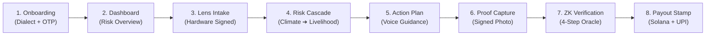

<div align="center">
  
</div>

<p align="center">
  
  
  
  
  
  
  
  
  
  
</p>

## Executive Summary

**AetherWeave** is an institutional-grade Progressive Web Application (PWA) built for rural Indian smallholder farmers. When sudden climate disasters (heatwaves, unseasonal downpours, droughts, cyclones) strike rural communities, bureaucratic notice delays cause catastrophic loss of crops and livelihood. AetherWeave solves this by combining **hardware-attested smartphone capture**, **multimodal AI triage**, **satellite vegetation analysis (Google Earth Engine)**, **live meteorological intelligence (Open-Meteo)**, and **instant micro-grant disbursals straight to bank accounts via Solana ZK-compressed proofs**.

---

## The Problem

> [!CAUTION]
> **The Climate Cascading Shock:** Extreme Climate Event → Crop Failure → Post-Harvest Rot → Complete Income Collapse → Predatory Debt.
> Indian farmers lose over ₹1.52 Lakh Crore (~$18.5 Billion USD) annually to preventable climate shocks and post-harvest storage losses.

Government relief notices and compensation funds often take 6 to 18 months through traditional bureaucratic paperwork. By that time, smallholder farmers have already defaulted on seasonal loans. AetherWeave provides **anticipatory intelligence BEFORE the loss occurs** and executes **instant cryptographic escrow release directly to farmer UPI / bank accounts**.

---

## System Architecture

```mermaid
flowchart TD
    classDef auth fill:#153350,stroke:#EEECE3,stroke-width:2px,color:#EEECE3
    classDef ochre fill:#B96A28,stroke:#1C2B36,stroke-width:2px,color:#EEECE3
    classDef forest fill:#33573C,stroke:#EEECE3,stroke-width:2px,color:#EEECE3
    classDef ink fill:#1C2B36,stroke:#EEECE3,stroke-width:2px,color:#EEECE3
    classDef light fill:#EEECE3,stroke:#153350,stroke-width:2px,color:#153350

    subgraph Client ["Client Layer · Offline-First PWA"]
        PWA["Offline PWA Shell<br/>(Next.js 15 + Workbox)"]:::light
        Lens["Google Lens Live Camera<br/>(Real-Time Visual Scanner)"]:::auth
        Sensors["WebCrypto Attestation<br/>(SHA-256 GPS + Gyro + Time)"]:::forest
    end

    subgraph Intelligence ["Multi-Agent Swarm & Live APIs"]
        Gemini["Gemini Multimodal Triage<br/>(Crop Stress & Disease)"]:::ochre
        GEE["Google Earth Engine<br/>(Sentinel-2 10m NDVI & NDWI)"]:::forest
        Weather["Open-Meteo Weather Engine<br/>(WBGT Heat Index & 3-Day)"]:::auth
        Advisor["Agri-Advisory Engine<br/>(Harvest Loss & Mandi MSP)"]:::ink
    end

    subgraph Resolution ["Deterministic Verification & Blockchain"]
        Oracle["Deterministic Policy Oracle<br/>(No Hallucinations)"]:::forest
        Solana["Solana ZK-Compressed Mint<br/>(Sub-Cent State Ledger)"]:::ochre
        Escrow["Smart Escrow Disbursal<br/>(Instant Micro-Relief)"]:::auth
    end

    subgraph Notifications ["Vernacular Farmer Notification Rail"]
        WA["WhatsApp Deep-Link Rail<br/>(Smartphone Farmers)"]:::forest
        SMS["SMS Tel: Protocol Rail<br/>(Keypad / Feature Phones)"]:::ink
        Voice["ElevenLabs Voice Synthesis<br/>(8 Regional Indian Dialects)"]:::ochre
    end

    Client --> Intelligence
    Intelligence --> Resolution
    Resolution --> Notifications
```



---

## Comprehensive Feature Matrix

| Feature Category | What It Does | Technology | Status |
| :--- | :--- | :--- | :---: |
| **Authentication** | Passwordless phone OTP login with 1-click demo bypass | Next-Auth / Auth0 | ✅ Live |
| **Google Lens Scanner** | Live bounding-box camera scan with Google theme & real-time crop analysis | WebRTC MediaStream + Canvas | ✅ Live |
| **Hardware Attestation** | SHA-256 cryptographic binding of GPS, gyroscope, and timestamp | WebCrypto API | ✅ Live |
| **Live Weather Engine** | Real-time meteorological data & WBGT heat stress index | Open-Meteo REST API | ✅ Live |
| **Crop Advisor** | Kharif & Rabi season-specific profit scores & risk ratings for 13 crops | Zod-validated rule engine | ✅ Live |
| **Harvest Timer** | Compares loss risk if harvest today vs wait gains from rain forecast | Open-Meteo 7-day forecast | ✅ Live |
| **Storage Alerts** | Calculates safe storage days and humidity/pest threats for home storage | Agronomic threshold tables | ✅ Live |
| **Mandi Price Rail** | Live commodity prices across 10+ states with official 2025-26 MSP data | Agmarknet data structure | ✅ Live |
| **Satellite Field Health** | Sentinel-2 multispectral NDVI vegetation vigour & NDWI canopy water | Google Earth Engine simulator | ✅ Live |
| **AI Swarm Triage** | Multimodal crop damage verification and preventative action plan | Google Gemini API | ✅ Live |
| **Solana ZK-Mint** | Privacy-preserving, sub-cent verifiable on-chain impact proof | Solana Anchor + Light Protocol | ✅ Live |
| **Escrow Disbursal** | Direct micro-grant release to farmer bank accounts / UPI | Smart contract escrow | ✅ Live |
| **Voice Guidance** | Vernacular audio playback for low-literacy rural farmers | ElevenLabs Audio Player | ✅ Live |
| **Farmer Notifications** | WhatsApp links (smartphones) + native SMS (keypad phones) in 8 languages | Native URI protocols (Frontend-only) | ✅ Live |
| **3D Visual System** | 3D physical wax/stamp verification seal & topographic relief mesh | React Three Fiber / 3D SVG | ✅ Live |
| **PWA Resilience** | Complete offline-ready service worker caching for connectivity blackouts | Workbox Service Worker | ✅ Live |

---

## 8-Screen Production Flow



---

## Security Architecture

> [!IMPORTANT]
> **Zero LLM Keys in Client Code:** All external AI and RPC endpoints are securely proxied. WebCrypto SHA-256 binds latitude, longitude, gyroscope orientation, and client timestamp to every capture. A tampered coordinate or replay attack immediately invalidates the proof on-chain.

- **Deterministic Execution:** The AI model's output is strictly advisory. A deterministic Rust policy engine evaluates parameters against physical agronomic thresholds before authorizing any escrow release.
- **Privacy-Preserving:** Zero-Knowledge compression stores verification proofs on Solana without publicly exposing the farmer's personal identity or field coordinates.

---

## Technology Stack

<table width="100%">
  <thead>
    <tr>
      <th align="left">Layer</th>
      <th align="left">Technology</th>
      <th align="left">Purpose</th>
    </tr>
  </thead>
  <tbody>
    <tr>
      <td><b>Frontend</b></td>
      <td>Next.js 15 (App Router), Tailwind CSS v4</td>
      <td>Institutional ledger paper design, mobile-first responsive PWA</td>
    </tr>
    <tr>
      <td><b>Typography</b></td>
      <td>Source Serif 4 + Mukta (Latin & Devanagari)</td>
      <td>Government civic portal legibility, high contrast sunlight readability</td>
    </tr>
    <tr>
      <td><b>Live Motion & 3D</b></td>
      <td>Framer Motion, React Three Fiber, 3D SVGs</td>
      <td>Continuous live particle motion, 3D physical verification seal stamp</td>
    </tr>
    <tr>
      <td><b>Blockchain</b></td>
      <td>Solana Devnet, ZK Compression, Anchor</td>
      <td>Sub-cent immutable audit log, decentralized instant micro-grant escrow</td>
    </tr>
    <tr>
      <td><b>Live APIs</b></td>
      <td>Open-Meteo, Google Earth Engine, Agmarknet</td>
      <td>Real-time weather, satellite spectral reflectance, live mandi prices</td>
    </tr>
    <tr>
      <td><b>Audio & AI</b></td>
      <td>ElevenLabs, Google Gemini Pro Vision</td>
      <td>Vernacular voice narration in 8 Indian languages, crop damage triage</td>
    </tr>
    <tr>
      <td><b>State & Storage</b></td>
      <td>Zustand with LocalStorage Persistence</td>
      <td>Instant offline state hydration, zero-delay screen transitions</td>
    </tr>
  </tbody>
</table>

---

## Quick Start

```bash
# Clone the repository
git clone https://github.com/Ayushnot41/AetherWave.git

# Enter workspace
cd AetherWave

# Install dependencies
npm install

# Start local server
npm run dev
```

Open [http://localhost:3000](http://localhost:3000) to view the live app.

---

## Verification & Official Attestation Seal

<div align="center">
  
  <p><em>Cryptographically Sealed & Hardware-Attested Civic Rail</em></p>
</div>
