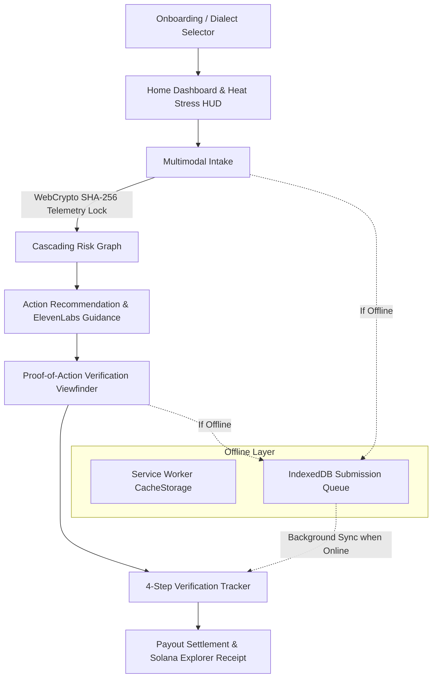

# AetherWeave

<p align="center">
  <svg width="100%" height="220" viewBox="0 0 1000 220" xmlns="http://www.w3.org/2000/svg">
    <defs>
      <linearGradient id="bg-grad" x1="0%" y1="0%" x2="100%" y2="100%">
        <stop offset="0%" stop-color="#0B1D13" />
        <stop offset="50%" stop-color="#152B1E" />
        <stop offset="100%" stop-color="#0A140F" />
      </linearGradient>
      <linearGradient id="terracotta-grad" x1="0%" y1="0%" x2="100%" y2="0%">
        <stop offset="0%" stop-color="#C2662D" />
        <stop offset="100%" stop-color="#D4920B" />
      </linearGradient>
      <linearGradient id="emerald-grad" x1="0%" y1="0%" x2="100%" y2="100%">
        <stop offset="0%" stop-color="#22C55E" />
        <stop offset="100%" stop-color="#15803D" />
      </linearGradient>
      <filter id="glow" x="-20%" y="-20%" width="140%" height="140%">
        <feGaussianBlur stdDeviation="8" result="blur" />
        <feComposite in="SourceGraphic" in2="blur" operator="over" />
      </filter>
      <filter id="shadow3d">
        <feDropShadow dx="3" dy="8" stdDeviation="6" flood-color="#000000" flood-opacity="0.6"/>
      </filter>
    </defs>
    <rect width="1000" height="220" rx="16" fill="url(#bg-grad)" />
    
    <!-- Isometric Grid Backdrop -->
    <g opacity="0.15" stroke="#22C55E" stroke-width="1">
      <line x1="100" y1="20" x2="300" y2="200" />
      <line x1="200" y1="20" x2="400" y2="200" />
      <line x1="300" y1="20" x2="500" y2="200" />
      <line x1="400" y1="20" x2="600" y2="200" />
      <line x1="500" y1="20" x2="700" y2="200" />
      <line x1="600" y1="20" x2="800" y2="200" />
      <line x1="700" y1="20" x2="900" y2="200" />
      <line x1="900" y1="20" x2="700" y2="200" />
      <line x1="800" y1="20" x2="600" y2="200" />
      <line x1="700" y1="20" x2="500" y2="200" />
      <line x1="600" y1="20" x2="400" y2="200" />
      <line x1="500" y1="20" x2="300" y2="200" />
      <line x1="400" y1="20" x2="200" y2="200" />
    </g>

    <!-- 3D Polyhedral Nodes -->
    <g filter="url(#shadow3d)">
      <!-- Left Node Cube 3D -->
      <polygon points="120,70 160,50 200,70 160,90" fill="#22C55E" opacity="0.8" />
      <polygon points="120,70 160,90 160,140 120,120" fill="#15803D" opacity="0.9" />
      <polygon points="160,90 200,70 200,120 160,140" fill="#14532D" />
      
      <!-- Right Node Cube 3D -->
      <polygon points="820,90 860,70 900,90 860,110" fill="#D4920B" opacity="0.8" />
      <polygon points="820,90 860,110 860,160 820,140" fill="#C2662D" opacity="0.9" />
      <polygon points="860,110 900,90 900,140 860,160" fill="#8C3F10" />

      <!-- Center Glowing Ring -->
      <circle cx="500" cy="110" r="48" fill="none" stroke="url(#terracotta-grad)" stroke-width="3" filter="url(#glow)" stroke-dasharray="8 6"/>
      <circle cx="500" cy="110" r="34" fill="#0E2317" stroke="#22C55E" stroke-width="2"/>
      <circle cx="500" cy="110" r="14" fill="url(#terracotta-grad)"/>
    </g>

    <!-- Dynamic Energy Arcs -->
    <path d="M 200,95 Q 350,30 500,110 T 820,115" fill="none" stroke="url(#emerald-grad)" stroke-width="2.5" stroke-dasharray="6 4" opacity="0.85" filter="url(#glow)"/>
    <path d="M 160,120 Q 320,180 500,110 T 860,100" fill="none" stroke="url(#terracotta-grad)" stroke-width="2" opacity="0.6"/>

    <!-- Title & Typography -->
    <text x="500" y="70" text-anchor="middle" font-family="-apple-system, BlinkMacSystemFont, 'Segoe UI', Roboto, sans-serif" font-weight="900" font-size="34" fill="#F8FAFC" letter-spacing="3">AETHERWEAVE</text>
    <text x="500" y="172" text-anchor="middle" font-family="-apple-system, BlinkMacSystemFont, 'Segoe UI', Roboto, sans-serif" font-weight="500" font-size="14" fill="#E8DCC8" letter-spacing="1.5">HYPERLOCAL CLIMATE RESILIENCE &amp; ESCROW DISBURSAL PWA</text>
    <text x="500" y="196" text-anchor="middle" font-family="-apple-system, BlinkMacSystemFont, 'Segoe UI', Roboto, sans-serif" font-weight="400" font-size="11" fill="#94A3B8">OFFLINE-FIRST PWA  •  WEBCRYPTO ATTESTATION  •  DETERMINISTIC ESCROW ORACLE</text>
  </svg>
</p>

<p align="center">
  
  
  
  
  
  
</p>

---

## 🌍 Executive Summary

**AetherWeave** is a production-grade, mobile-first Progressive Web Application (PWA) designed to protect vulnerable informal sector communities (street vendors, delivery couriers, agricultural workers) facing extreme climate hazards.

Operating with **zero connectivity barriers**, AetherWeave combines:
1. **Multimodal Edge Intake**: Voice notes and camera capture with WebCrypto SHA-256 hardware attestation (GPS coordinates, gyroscope tilt, timestamp locking).
2. **Cascading Risk Intelligence**: Multi-tiered impact modeling projecting physical climate stress onto personal health and daily livelihood earnings.
3. **Parametric Preventative Micro-Grants**: Fast-track micro-relief (\$5.00) disbursed before damages become catastrophic.
4. **Deterministic Oracle Governance**: Gemini AI models serve strictly advisory functions. Fund transfers are controlled by deterministic threshold rules and Solana ZK-minted proof receipts.

---

## ⚡ Architecture & Flow



---

## 📱 Complete 8-Screen Production Flow

| Screen | Route | Key Features |
|---|---|---|
| **0. Auth & Routing** | `/` | Hydration guard, session token inspection, automatic routing |
| **1. Onboarding** | `/onboarding` | Passwordless phone OTP, 7-dialect vernacular selector (Hindi, Tamil, Telugu, Bengali, Marathi, Gujarati, English) |
| **2. Home Dashboard** | `/dashboard` | Ambient heat index gauge, cascading risk summary, offline snapshot banner, rapid reporting CTA |
| **3. Multimodal Intake** | `/intake` | WebRTC camera viewfinder, audio recorder, live hardware GPS/Gyro HUD, cryptographic telemetry attestation |
| **4. Cascading Risk** | `/cascade` | 3-node dependency graph (Climate 44°C $\rightarrow$ Health Extreme $\rightarrow$ Livelihood \$18 at risk), vernacular breakdown |
| **5. Action Recommendation** | `/action` | Grant-eligible preventative protocol (\$5.00), ElevenLabs voice guidance playback with visual audio waveform |
| **6. Verification Capture** | `/verification/capture` | Native camera capture, cryptographic proof packaging, sensor telemetry overlay |
| **7. Verification Status** | `/verification/status` | Real-time 4-step vertical tracker: Gemini Audit $\rightarrow$ Oracle Validation $\rightarrow$ Solana ZK Mint $\rightarrow$ Escrow Disbursal |
| **8. Grant Payout** | `/payout` | \$5.00 grant receipt, instant UPI settlement badge, copyable Solana transaction signature, Solana Explorer link |
| **Fallback** | `/offline` | Full offline UX with local cache viewing and background sync indicators |

---

## 🛡️ Security & Defensive Engineering

- **Deterministic Oracle Isolation**: No LLM makes financial or disbursal decisions directly. AI swarm scores provide informational recommendations; strict deterministic oracles enforce validation rules before smart contract invocation.
- **Hardware Telemetry Attestation**: Image frames captured in `/verification/capture` and `/intake` are bound to device coordinates (latitude, longitude, accuracy) and motion vectors (alpha, beta, gamma) via client-side `crypto.subtle.digest("SHA-256")`.
- **Zero Key Leaks**: All client code accesses only public environment parameters prefixed with `NEXT_PUBLIC_`. Private API keys and sovereign secrets reside exclusively on secure backend runtimes.
- **Offline Integrity**: The offline store guarantees idempotency; buffered sync queues prevent duplicate grant submissions.

---

## 🚀 Getting Started

### Prerequisites
- Node.js 18.x, 20.x, or 22+
- npm or pnpm

### Installation

```bash
# Clone the repository
git clone https://github.com/your-username/AetherWeave.git
cd AetherWeave

# Install dependencies
npm install

# Setup environment variables
cp .env.example .env.local

# Run the development server
npm run dev
```

Visit [http://localhost:3000](http://localhost:3000) on your desktop or mobile browser.

---

## 🧪 Verification & Typechecking

All production components adhere to strict TypeScript standards with zero ambient errors:

```bash
# Verify TypeScript without emitting files
npm run typecheck # or: node node_modules/typescript/bin/tsc --noEmit
```

---

## 📜 License

This project is licensed under the MIT License — see the [LICENSE](LICENSE) file for details.
