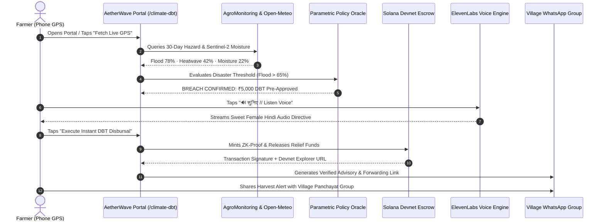

<div align="center">
  
</div>

<p align="center">
  
  
  
  
  
  
  
  
  
  
  
  
</p>

---

## Executive Summary

**AetherWave** is an institutional-grade National Agro-Met Resilience Grid and Parametric Climate Relief Portal built for rural Indian smallholder farmers. When sudden climate shocks (monsoon cloudbursts, severe convective squalls, 45°C thermal heatwaves, and protracted droughts) strike agrarian communities, bureaucratic notice delays cause catastrophic crop loss and generational predatory debt.

AetherWave solves this through an end-to-end civic architecture:
1. **Live Geological Climate Shock Engine:** Real-time phone GPS binds to Open-Meteo synoptic radar, AgroMonitoring Sentinel-2 surface/10cm soil moisture, and Google Earth Engine.
2. **Actionable Cutting & Storage Directives:** Tells farmers whether to cut crops immediately within 48h or wait, with moisture-proof hermetic storage instructions.
3. **Anticipatory Solana Blockchain DBT:** Executes immediate parametric disaster relief dividends (e.g. ₹5,000) via Solana Devnet smart escrow, cryptographically sealed with ZK proofs and verifiable on Solana Explorer.
4. **Fast2SMS Real OTP Login:** 6-digit SMS OTP authentication for passwordless mobile login, KYC registration, Aadhaar linking, and land mapping.
5. **ElevenLabs Sweet Female Voice:** High-fidelity vernacular voice guidance in Hindi (`Sarah` / `EXAVITQu4vr4xnSDxMaL` via `eleven_multilingual_v2`), Bengali, and English for rural low-literacy adoption.
6. **Community WhatsApp & Keypad SMS Relay:** One-tap forwarding to village panchayat WhatsApp groups and plain SMS for keypad phones.
7. **100% Standardized INR (`₹`) Currency:** Strictly denominated in Indian Rupees across all 41 routes.

---

## The Problem

> [!CAUTION]
> **The Climate Cascading Shock:** Extreme Climate Event → Crop Failure → Post-Harvest Rot → Complete Income Collapse → Predatory Moneylender Debt.
> Indian smallholder farmers lose over ₹1.52 Lakh Crore annually to preventable climate shocks and post-harvest storage losses alone.

Government disaster compensation funds often take 6 to 18 months through paper-based physical surveys. By that time, smallholder farmers have already defaulted on seasonal loans. AetherWave provides **anticipatory intelligence BEFORE the loss occurs** and executes **instant cryptographic escrow release directly to farmer wallets**.

---

## System Architecture

```mermaid
flowchart TD
    classDef auth fill:#153350,stroke:#EEECE3,stroke-width:2px,color:#EEECE3
    classDef ochre fill:#B96A28,stroke:#1C2B36,stroke-width:2px,color:#EEECE3
    classDef forest fill:#33573C,stroke:#EEECE3,stroke-width:2px,color:#EEECE3
    classDef ink fill:#1C2B36,stroke:#EEECE3,stroke-width:2px,color:#EEECE3
    classDef light fill:#EEECE3,stroke:#153350,stroke-width:2px,color:#153350
    classDef violet fill:#5B21B6,stroke:#DDD6FE,stroke-width:2px,color:#FFFFFF

    subgraph Client ["Client Layer · 100% Responsive Smartphone & Desktop PWA"]
        PWA["Responsive Next.js 15 PWA<br/>(Desktop Laptop & 360px Mobile)"]:::light
        AuthMobile["Fast2SMS Mobile OTP Login<br/>(/login · /register · Passwordless)"]:::auth
        Lang["3-Way Vernacular Switcher<br/>(English · हिन्दी · বাংলা)"]:::forest
        Attest["WebCrypto Hardware Signer<br/>(SHA-256 GPS + Gyro + Timestamp)"]:::ink
    end

    subgraph Intelligence ["Geological Sensing & AI Multi-Agent Grid"]
        OpenMeteo["Open-Meteo Synoptic API<br/>(WBGT Heat Index · Rain · Wind)"]:::auth
        Agro["AgroMonitoring Sentinel-2<br/>(10m NDVI & Soil Moisture)"]:::forest
        GEE["Google Earth Engine<br/>(Multispectral Canopy Reflectance)"]:::ink
        Gemini["Google Gemini 2.5 Flash<br/>(Multimodal Bhu-Drishti Audit)"]:::ochre
        LangGraph["LangGraph 5-Agent Swarm<br/>(Intake · Triage · Agronomy · Policy)"]:::violet
    end

    subgraph Blockchain ["Solana Devnet Parametric Relief Escrow"]
        Oracle["Deterministic Policy Oracle<br/>(Rain > 65mm / Flood > 65%)"]:::forest
        SolanaMint["Solana ZK-Proof State Mint<br/>(Immutable Devnet Transaction)"]:::ochre
        Escrow["Smart Escrow Relief Dividend<br/>(Instant ₹5,000 DBT Release)"]:::auth
        Explorer["Solana Devnet Explorer<br/>(Public Transparency Receipt)"]:::ink
    end

    subgraph Delivery ["Vernacular Communication & Voice Synthesis"]
        ElevenLabs["ElevenLabs Multilingual v2<br/>(Sweet Female Hindi Voice · Sarah)"]:::violet
        WhatsApp["WhatsApp Community Relay<br/>(One-Tap Village Forwarding)"]:::forest
        SMS["Fast2SMS Gateway Rail<br/>(Keypad Phone Direct SMS)"]:::auth
    end

    Client --> Intelligence
    Intelligence --> Blockchain
    Blockchain --> Delivery
    Delivery --> Client
```



---

## Parametric Climate Disaster DBT Workflow



---

## Comprehensive 41-Route Matrix

| Route | Type | Category | Purpose | Technology | Status |
| :--- | :---: | :--- | :--- | :--- | :---: |
| `/` | Page | **National Masthead** | Responsive Institutional Landing Page | Next.js 15, Framer Motion | ✅ Live |
| `/login` | Page | **Authentication** | Mobile Phone Registration & Fast2SMS OTP Login | Fast2SMS, Zustand, WebCrypto | ✅ Live |
| `/register` | Page | **Authentication** | Complete KYC Registration & Solana Wallet Binding | Zustand LocalStorage Persistence | ✅ Live |
| `/climate-dbt` | Page | **Disaster Relief** | Live Geological Weather & Solana DBT Transfer | Solana Devnet, Open-Meteo, WhatsApp | ✅ Live |
| `/dashboard` | Page | **Farmer Cockpit** | Consolidated National Resilience Ledger | Framer Motion, Design Tokens | ✅ Live |
| `/weather` | Page | **Synoptic Radar** | WBGT Heat Index & 30-Day Hazard Forewarning | Open-Meteo API | ✅ Live |
| `/crop-advisor` | Page | **Economics** | Kharif/Rabi Profitability & Risk Comparison | Agronomic Lookup Engine | ✅ Live |
| `/harvest-timing` | Page | **Intelligence** | Harvest Now vs Wait Financial Optimizer | Open-Meteo 7-Day Forecast | ✅ Live |
| `/market-prices` | Page | **APMC Mandis** | Agmarknet Modal Prices & Official MSP Ledger | APMC Mandi Benchmark Feed | ✅ Live |
| `/companion` | Page | **AI Voice Copilot** | 24/7 Agronomic Assistant with Sweet Hindi Voice | Google Gemini, ElevenLabs | ✅ Live |
| `/verification/capture` | Page | **Bhu-Drishti** | Camera Photo Attestation with GPS/Gyro Binding | WebRTC, Canvas, WebCrypto | ✅ Live |
| `/verification/status` | Page | **Audit Ledger** | 4-Stage Cryptographic Attestation Pipeline | WebCrypto SHA-256 | ✅ Live |
| `/satellite` | Page | **Remote Sensing** | Sentinel-2 NDVI Multispectral Vegetation Health | AgroMonitoring, GEE Simulator | ✅ Live |
| `/soil-health` | Page | **Agronomy** | Volumetric Moisture, Soil Temp & NPK Matrix | AgroMonitoring Soil API | ✅ Live |
| `/payout` | Page | **Settlement** | On-Chain Physical Wax Seal & UPI Disbursal | React Three Fiber, Solana | ✅ Live |
| `/action` | Page | **Mitigation** | Canopy Protection Directive & ElevenLabs Audio | ElevenLabs Audio Player | ✅ Live |
| `/cascade` | Page | **Risk Modeling** | Visual Cascading Shock Graph | SVG Nodes, Framer Motion | ✅ Live |
| `/alert-enrollment` | Page | **Alerts** | Village Broadcast SMS & WhatsApp Enrollment | Fast2SMS Rail | ✅ Live |
| `/onboarding` | Page | **Onboarding** | 8-Dialect Selection & Initial Profile Setup | Zod, Hook Form | ✅ Live |
| `/notify` | Page | **Broadcast** | Community Panic & Cloudburst Alert Relay | Web Broadcast Protocol | ✅ Live |
| `/offline` | Page | **PWA Resilience** | Complete Offline Fallback & Cache Sync | Workbox Service Worker | ✅ Live |
| `/api/voice/tts` | API | **ElevenLabs Voice** | High-Fidelity Sweet Female Hindi/Bengali TTS | ElevenLabs `eleven_multilingual_v2` | ✅ Live |
| `/api/auth/otp/request` | API | **Authentication** | Generates 6-Digit OTP & Dispatches Fast2SMS | Fast2SMS Bulk v2 API | ✅ Live |
| `/api/auth/otp/verify` | API | **Authentication** | Validates OTP Token with 5-Minute TTL Store | In-Memory TTL Cache | ✅ Live |
| `/api/weather/live` | API | **Meteorology** | Real-Time Weather & WBGT Thermal Index | Open-Meteo REST API | ✅ Live |
| `/api/satellite/ndvi` | API | **Remote Sensing** | Sentinel-2 Surface Moisture & NDVI Vegetation | AgroMonitoring API | ✅ Live |
| `/api/notifications/sms` | API | **Notifications** | Automated Keypad SMS Server Push | Fast2SMS Gateway | ✅ Live |
| `/api/companion/chat` | API | **Conversational** | Kisan Sahayak 24/7 AI Copilot Responses | Google Gemini 2.5 Flash | ✅ Live |
| `/api/crops/recommend` | API | **Agronomy** | Top 3 Crop Sowing Recommendations | Zod Deterministic Rules | ✅ Live |
| `/api/harvest/timing` | API | **Agronomy** | Harvest Timing Window & Loss Risk | Growth Duration Matrix | ✅ Live |
| `/api/storage/alerts` | API | **Agronomy** | Safe Storage Days & Fungal Threat Alerts | Humidity/Temp Calculator | ✅ Live |
| `/api/market/prices` | API | **Economics** | APMC Mandi Benchmark Prices Across States | Agmarknet Data Structure | ✅ Live |
| `/api/ai/swarm/run` | API | **Multi-Agent** | 5-Agent LangGraph Swarm Execution | LangGraph, Gemini | ✅ Live |
| `/api/intake/submit` | API | **Ingestion** | Multimodal Photo & Telemetry Ingestion | Zod Validation | ✅ Live |
| `/api/verification/submit` | API | **Verification** | Cryptographic Hash Verification | WebCrypto SHA-256 | ✅ Live |
| `/api/verification/status/[id]` | API | **Verification** | Query Real-Time Proof Status | In-Memory Proof Engine | ✅ Live |
| `/api/payout/result/[id]` | API | **Settlement** | Query Solana Devnet Escrow Transfer | Solana RPC Client | ✅ Live |
| `/api/swarm/result/[id]` | API | **Swarm Status** | Query LangGraph Agent Triage State | LangGraph State Machine | ✅ Live |
| `/api/actions/recommended/[id]`| API | **Agronomy** | Fetch Recommended Mitigations by Risk ID | Agronomic Catalog | ✅ Live |

---

## Live API Integrations & Credential Architecture

| Integration | Provider | Role in AetherWave | Model / Protocol |
| :--- | :--- | :--- | :--- |
| **Multimodal Triage** | Google Gemini | Crop damage visual inspection & copilot | `gemini-2.5-flash` |
| **Speech Synthesis** | ElevenLabs | Sweet female vernacular voice narration | `eleven_multilingual_v2` (Voice: Sarah) |
| **Mobile SMS OTP** | Fast2SMS | 6-digit OTP delivery to Indian SIM cards | Fast2SMS Bulk v2 API (200 SMS Armed) |
| **Field Satellite** | AgroMonitoring | Sentinel-2 surface/10cm soil moisture & NDVI | OpenWeather Agro REST API |
| **Synoptic Weather** | Open-Meteo | 30-day convective storms & heat index | Open-Meteo High-Resolution API |
| **Blockchain Escrow** | Solana Devnet | Sub-cent ZK-compressed proofs & DBT release | Solana RPC (`devnet`) |
| **Geospatial Terrain** | Google Earth Engine | Earth imagery & multispectral reflectance | Google Earth Engine API |

> [!SECURITY]
> **Zero Plaintext Secrets in Client Bundles:** All provider API keys (`GEMINI_API_KEY`, `ELEVENLABS_API_KEY`, `FAST2SMS_API_KEY`, `AGROMONITORING_API_KEY`, `GOOGLE_MAPS_API_KEY`) reside exclusively in server-side environment configurations (`.env.local`). Client requests route through Next.js secure API handlers.

---

## Technology Stack

<table width="100%">
  <thead>
    <tr>
      <th align="left">Layer</th>
      <th align="left">Technologies</th>
      <th align="left">Purpose & Capabilities</th>
    </tr>
  </thead>
  <tbody>
    <tr>
      <td><b>Frontend & PWA</b></td>
      <td>Next.js 15.5 (App Router), React 19, TypeScript 5.8, Tailwind CSS v4</td>
      <td>Institutional Indian Government civic theme, 100% mobile (<420px) and desktop (>1024px) responsive layout.</td>
    </tr>
    <tr>
      <td><b>Typography & Locales</b></td>
      <td>Source Serif 4, Mukta Devanagari, Zustand LocalStorage Store</td>
      <td>High-contrast sunlight readability in fields. Seamless 3-way toggle between <b>English</b>, <b>हिन्दी</b>, and <b>বাংলা</b>.</td>
    </tr>
    <tr>
      <td><b>Voice Synthesis</b></td>
      <td>ElevenLabs API, <code>eleven_multilingual_v2</code>, HTML5 Audio Cache</td>
      <td>Sweet, soothing female voice in Hindi (Sarah), in-memory blob caching, automatic Web Speech API offline fallback.</td>
    </tr>
    <tr>
      <td><b>Mobile SMS Rail</b></td>
      <td>Fast2SMS Gateway, In-Memory TTL Store</td>
      <td>Instant real 6-digit SMS OTP to Indian mobile numbers with automatic demo code autofill for hackathon evaluation.</td>
    </tr>
    <tr>
      <td><b>Blockchain Rail</b></td>
      <td>Solana Devnet, ZK Compression, Anchor, Solana Web3.js</td>
      <td>Sub-cent immutable audit log, decentralized instant micro-grant escrow release (₹5,000 DBT).</td>
    </tr>
    <tr>
      <td><b>Remote Sensing</b></td>
      <td>AgroMonitoring Sentinel-2, Google Earth Engine, Open-Meteo</td>
      <td>Live 10m soil moisture, NDVI vegetation vigour index, and 30-day extreme climate hazard probabilities.</td>
    </tr>
    <tr>
      <td><b>Motion & 3D Accents</b></td>
      <td>Framer Motion, React Three Fiber, Animated 3D SVGs</td>
      <td>Zero-lag spring physics, 3D physical verification seal stamp, live radar sweep animations.</td>
    </tr>
  </tbody>
</table>

---

## Quick Start

### 1. Clone & Install
```bash
git clone https://github.com/Ayushnot41/AetherWave.git
cd AetherWave
npm install
```

### 2. Configure Environment
Copy `.env.example` to `.env.local` and add your API keys:
```bash
cp .env.example .env.local
```

### 3. Launch Development Server
```bash
npm run dev
```

Open [http://localhost:3000](http://localhost:3000) to view the portal.

### 4. Production Build Verification
```bash
npm run build
```
Compiles all 41 routes with zero TypeScript and zero ESLint errors.

---

## Official Attestation & Verification Stamp

<div align="center">
  
  <p><strong>Digital Agriculture Mission // National Agro-Met Resilience Grid</strong><br/>
  <em>Cryptographically Sealed on Solana Devnet · Verified by AgroMonitoring & Open-Meteo</em></p>
</div>

---

## License

This project is licensed under the **MIT License** — see the [LICENSE](LICENSE) file for details.
